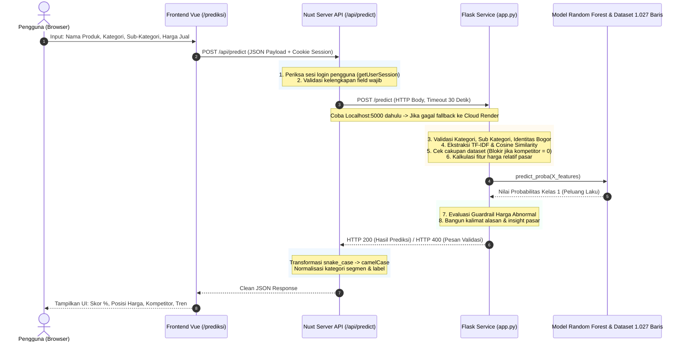

# DOKUMENTASI SISTEM: INTEGRASI WEB SERVICE (NUXT) & MACHINE LEARNING (FLASK) BESERTA SIMULASI PERHITUNGAN MANUAL

> **Tujuan Dokumen:**  
> Dokumen ini dirancang sebagai panduan komprehensif yang siap digunakan sebagai referensi penulisan **Laporan MBKM / Skripsi / Tugas Akhir** (khususnya untuk **Bab III: Perancangan Sistem & Metodologi** dan **Bab IV: Implementasi, Pengujian & Analisis**).

---

## DAFTAR ISI
1. [BAB I — Gambaran Umum Arsitektur Sistem](#1-gambaran-umum-arsitektur-sistem)
2. [BAB II — Mekanisme Web Service (Nuxt Server) Mengelola Flask](#2-mekanisme-web-service-nuxt-server-mengelola-flask)
3. [BAB III — Alur Kerja Internal Model di Flask API](#3-alur-kerja-internal-model-di-flask-api)
4. [BAB IV — Rumus-Rumus Matematis Sistem](#4-rumus-rumus-matematis-sistem)
5. [BAB V — Simulasi Perhitungan Manual Step-by-Step (Studi Kasus Produk Nyata)](#5-simulasi-perhitungan-manual-step-by-step)
6. [BAB VI — Panduan Penempatan pada Laporan / Skripsi](#6-panduan-penempatan-pada-laporan--skripsi)

---

## 1. GAMBARAN UMUM ARSITEKTUR SISTEM

Sistem **RadarUMKMBogor** menggunakan arsitektur *microservice terpisah* dengan pola **Backend-for-Frontend (BFF) / API Gateway**:
1. **Frontend Client**: Nuxt 4 (Vue 3) berjalan di peramban pengguna.
2. **Web Backend (Gateway)**: Nitro Server (Nuxt Serverless Engine) bertindak sebagai gerbang tunggal yang mengatur otentikasi pengguna, validasi awal, komunikasi jaringan, serta transformasi data.
3. **Machine Learning Service**: Python Flask API yang mengelola proses NLP, pencarian kemiripan produk (Cosine Similarity), ekstraksi fitur pasar, dan inferensi model Random Forest.

### Diagram Alur Komunikasi Sistem



---

## 2. MEKANISME WEB SERVICE (NUXT SERVER) MENGELOLA FLASK

Implementasi backend Nuxt terdapat pada file `server/api/predict.post.ts`. Nuxt mengelola Flask melalui 5 pilar utama:

### A. Otentikasi Sesi di Layer Gateway
Sebelum mengirimkan beban kerja ke server ML, Nuxt memeriksa apakah user telah terotentikasi:
```typescript
const session = await getUserSession(event);
if (!session.user) {
  throw createError({ statusCode: 401, message: 'Unauthorized' });
}
```
*Tujuan akademis/teknis:* Melindungi layanan Machine Learning dari serangan eksploitasi publik, *spamming*, dan pemborosan komputasi server.

### B. Validasi Input Dasar
Memeriksa bahwa ketiga atribut utama (`namaProduk`, `kategori`, `hargaProduk`) tidak bernilai `null` atau kosong. Jika tidak lengkap, langsung dikembalikan error HTTP 400 tanpa memanggil Flask.

### C. Mekanisme Failover & Prioritas Ganda (Dual Endpoint Strategy)
Layanan ML dijalankan pada dua kemungkinan lingkungan: lokal (*development*) dan cloud Render (*production*). Nuxt mengimplementasikan mekanisme *failover*:
1. **Prioritas Pertama:** Mencoba koneksi lokal `http://localhost:5000`.
2. **Prioritas Kedua (Fallback):** Jika lokal gagal/tidak aktif, otomatis memanggil URL production di Render (`config.flaskApiUrl`).
3. **Timeout Dinamis (30.000 ms):** Menggunakan batas waktu 30 detik untuk mengantisipasi fenomena *cold-start* (waktu bangun server Render gratis yang tidur setelah 15 menit *idle*).

### D. Penanganan Error Cerdas (Business Error vs Network Error)
Nuxt membedakan respon kegagalan menjadi dua kategori:
1. **Business/Domain Exception (Status 400/422):** Jika Flask menolak input karena aturan bisnis (misal: harga $\le 0$, salah memilih kategori, tidak ada identitas Bogor, atau produk belum ada di dataset), pesan asli dari Flask ditangkap dan diteruskan ke frontend sebagai status HTTP 422 agar dapat ditampilkan sebagai pesan edukasi yang ramah pengguna.
2. **Service Downtime (Status 503):** Jika seluruh URL tidak dapat dihubungi (koneksi putus), Nuxt melemparkan error HTTP 503 dengan narasi panduan perbaikan yang jelas.

### E. Transformasi Data (Adapter Pattern)
Nuxt mengubah struktur data Python menjadi standar JavaScript yang bersih:
* Variabel Python `peluang_laku_persen` $\rightarrow$ JavaScript `predictionScore`.
* Menentukan label biner klasifikasi: `predictionLabel = predictionScore >= 50 ? 1 : 0`.
* Menyelaraskan teks segmentasi: Mengubah kategori `'Premium'` menjadi `'Mahal'`, serta mendeteksi selisih persentase $< -50\%$ sebagai segmen risiko `'Sangat Murah'`.
* Menata ulang array kompetitor serupa, produk terpopuler, dan posisi ranking kategori pasar.

---

## 3. ALUR KERJA INTERNAL MODEL DI FLASK API

Layanan Flask berada di folder `flask_api/app.py`. Saat menerima request prediksi, alur kerja di dalamnya mencakup:

### 1. Pre-Caching Saat Server Dinyalakan (Optimasi Latensi)
Untuk menghindari overhead I/O berulang pada setiap request:
* File model `model_umkm_bogor_v3.joblib` di-load sekali ke RAM.
* Dataset 1.027 produk UMKM Bogor di-load ke DataFrame.
* Matriks `TF-IDF` seluruh produk referensi dihitung di awal (`X_train_text_db`).
* Tabel statistik pasar kategori (`market_stats_v3.csv`) di-cache di memori.

### 2. Validasi 4 Lapis Sebelum Komputasi Model
* **Lapis 1:** Validasi harga dasar ($H > 0$).
* **Lapis 2:** Validasi konsistensi kategori via `PRODUK_KATEGORI_MAP` (contoh: produk bernama *"Kopi Puncak"* jika dimasukkan kategori *"Makanan"* akan otomatis ditolak).
* **Lapis 3:** Validasi sub-kategori via `PRODUK_SUB_KATEGORI_MAP` (contoh: *"Bolu Talas"* jika dipilih sub-kategori *"Lauk"* akan ditolak).
* **Lapis 4:** Validasi identitas lokal Bogor (`KATA_KUNCI_WILAYAH_BOGOR`).

### 3. Pencarian Kompetitor dengan TF-IDF & Cosine Similarity
* Nama produk dibersihkan dengan **PySastrawi** (stemmer Bahasa Indonesia) dan disaring dari *stopwords*.
* Teks diubah menjadi vektor numerik TF-IDF.
* Dihitung *Cosine Similarity* terhadap 1.027 data produk di database.
* Diambil maksimal 6 produk teratas dengan nilai kemiripan $> 0.05$.

### 4. Guardrail Blokir Prediksi & Deteksi Cakupan Dataset
* **Jika jumlah kompetitor = 0:** Sistem **memblokir proses prediksi** dan mengembalikan pesan maaf serta saran perbaikan. Sistem menolak membuat prediksi palsu pada produk yang belum pernah di-scraping.
* **Peringatan Kemiripan Rendah ($< 15\%$):** Prediksi tetap dijalankan, namun field `peringatan_dataset` diberi nilai peringatan bahwa akurasi berada di level sedang.

### 5. Ekstraksi Fitur Bisnis (Relative Market Features)
Model v3 dilatih bukan menggunakan harga absolut, melainkan variabel bernilai relatif:
* `rasio_harga`: Nilai harga dibagi median harga kategori ($H / M$).
* `zscore_harga`: Seberapa jauh harga dari rata-rata pasar dalam satuan standar deviasi.
* `log_harga`: Nilai $\ln(1 + H)$ untuk menormalkan distribusi data yang menceng (*skewed*).
* `segmen_harga`: Nilai ordinal 0 (Murah), 1 (Menengah), 2 (Mahal) berdasarkan kuartil Q1 dan Q3 kategori.
* `popularity_score`: Diambil dari estimasi rata-rata kompetitor: $\text{Rating} \times \ln(1 + \text{Terjual})$.
* `jumlah_log` & `revenue_proxy_log`: Estimasi omzet pasar produk sejenis.

### 6. Inferensi Random Forest & Guardrail Bisnis (Koreksi Outlier)
Pohon keputusan dievaluasi menggunakan `predict_proba(X)`. Namun, model Machine Learning berbasis pohon terkadang menghasilkan probabilitas yang tidak logis pada rentang harga ekstrem. Oleh karena itu, sistem menerapkan **Guardrail Aturan Bisnis**:
* Jika rasio harga $\ge 5.0\times$ median $\rightarrow$ Probabilitas dipatok maksimal **2%**.
* Jika rasio harga $\ge 3.0\times$ median $\rightarrow$ Probabilitas dipatok maksimal **15%**.
* Jika rasio harga $\ge 2.0\times$ median $\rightarrow$ Probabilitas dipatok maksimal **35%**.
* Jika rasio harga $\ge 1.3\times$ median $\rightarrow$ Probabilitas dipatok maksimal **45%**.
* Jika rasio harga $< 0.3\times$ median (terlalu murah / mencurigakan) $\rightarrow$ Probabilitas dipatok maksimal **35%**.

### 7. Pembangkitan Alasan Dinamis (Natural Reasoning Generator)
Sistem secara otomatis merangkai narasi penjelasan dalam bentuk kalimat bahasa Indonesia berdasarkan:
* Jumlah kompetitor di pasar.
* Posisi selisih harga terhadap median.
* Volume penjualan rata-rata produk sejenis.
* Reputasi rating kompetitor.

---

## 4. RUMUS-RUMUS MATEMATIS SISTEM

Rumus-rumus ini dapat langsung dimasukkan ke dalam subbab metodologi laporan:

### 1. Pembobotan Kata (TF-IDF)
$$\text{TF}(t, d) = \frac{f_{t, d}}{\sum_{t' \in d} f_{t', d}}$$

$$\text{IDF}(t) = \ln\left(\frac{1 + N}{1 + \text{DF}(t)}\right) + 1$$

$$W_{t, d} = \text{TF}(t, d) \times \text{IDF}(t)$$

### 2. Kemiripan Teks Produk (Cosine Similarity)
$$\text{Cosine Sim}(\vec{A}, \vec{B}) = \frac{\vec{A} \cdot \vec{B}}{\|\vec{A}\| \|\vec{B}\|} = \frac{\sum_{i=1}^{n} A_i B_i}{\sqrt{\sum_{i=1}^{n} A_i^2} \times \sqrt{\sum_{i=1}^{n} B_i^2}}$$

### 3. Popularity Score (Indeks Daya Tarik Produk)
$$\text{Popularity Score} = \text{Rating} \times \ln(1 + \text{Jumlah Terjual})$$

### 4. Rasio Harga terhadap Median Pasar ($R$)
$$R = \min\left(\frac{H_{\text{input}}}{M_{\text{kategori}}}, 50\right)$$

### 5. Z-Score Deviasi Harga ($Z$)
$$Z = \text{clip}\left(\frac{H_{\text{input}} - \mu_{\text{kategori}}}{\sigma_{\text{kategori}}}, -5, 5\right)$$

### 6. Selisih Persentase Harga terhadap Pasar ($\delta$)
$$\delta = \frac{H_{\text{input}} - M_{\text{kategori}}}{M_{\text{kategori}}} \times 100\%$$

### 7. Transformasi Logaritmik (Stabilisasi Skala)
$$\text{log\_harga} = \ln(1 + H_{\text{input}})$$
$$\text{jumlah\_log} = \ln(1 + \text{jumlah\_terjual})$$
$$\text{revenue\_proxy\_log} = \ln(1 + (H_{\text{input}} \times \text{jumlah\_terjual}))$$

### 8. Probabilitas Random Forest (Ensemble Averaging)
$$P(Y=1 \mid X) = \frac{1}{M} \sum_{m=1}^{M} P_m(Y=1 \mid X)$$
*(Di mana $M$ adalah jumlah pohon keputusan di dalam hutan, misal $M = 100$).*

---

## 5. SIMULASI PERHITUNGAN MANUAL STEP-BY-STEP

Berikut adalah simulasi perhitungan menggunakan angka-angka nyata yang dapat dijadikan bahan contoh pengujian di laporan:

### Skenario Uji:
* **Nama Produk:** `"Bolu Talas Bogor Original"`
* **Kategori:** `Makanan`
* **Sub-Kategori:** `Kue & Roti`
* **Harga Produk ($H_{\text{input}}$):** `Rp 35.000`

---

### Langkah 1: Text Preprocessing & Stemming (PySastrawi)
1. **Lowercase & Hapus Simbol:** `"bolu talas bogor original"`
2. **Stopwords Removal:** Kata `"original"` dan kata hubung dibuang. Kata `"bogor"` dipertahankan untuk cek identitas.
3. **Stemming Bahasa Indonesia:** `"bolu talas bogor"`

---

### Langkah 2: Perhitungan Cosine Similarity
Misalkan dalam dataset terdapat produk kompetitor:
* Dokumen Kompetitor: `"bolu talas bogor rasa keju"` $\rightarrow$ Token relevan: `[bolu, talas, bogor]`
* Vektor Query $\vec{A}$: `[bolu: 0.577, talas: 0.577, bogor: 0.577]`
* Vektor Database $\vec{B}$: `[bolu: 0.577, talas: 0.577, bogor: 0.577]`

$$\vec{A} \cdot \vec{B} = (0.577 \times 0.577) + (0.577 \times 0.577) + (0.577 \times 0.577) = 0.333 + 0.333 + 0.333 = 0.999 \approx 1.00$$

$$\|\vec{A}\| = \sqrt{0.577^2 + 0.577^2 + 0.577^2} = 1.00$$
$$\|\vec{B}\| = \sqrt{0.577^2 + 0.577^2 + 0.577^2} = 1.00$$

$$\text{Cosine Similarity} = \frac{1.00}{1.00 \times 1.00} = \mathbf{1.00 \ (100\% \text{ Mirip})}$$

*Kesimpulan Tahap 2:* Nilai kemiripan sangat tinggi ($100\% > 35\%$). Sistem mendeteksi kompetitor kuat dan tidak mengeluarkan status peringatan kekurangan dataset.

---

### Langkah 3: Estimasi Metrik Pasar dari Kompetitor
Misalkan dari kompetitor teratas yang ditemukan diperoleh:
* Rata-rata Rating ($\text{rating\_est}$): **4.80**
* Median Terjual ($\text{jumlah\_est}$): **150 unit**

**Perhitungan Skor Popularitas:**
$$\text{Popularity Score} = 4.80 \times \ln(1 + 150) = 4.80 \times \ln(151) = 4.80 \times 5.0173 = \mathbf{24.08}$$

---

### Langkah 4: Perhitungan Fitur Bisnis Pasar (Statistik Kategori "Makanan")
Berdasarkan data referensi historis kategori Makanan pada dataset:
* Median Kategori ($M$): **Rp 40.000**
* Rata-rata Kategori ($\mu$): **Rp 42.000**
* Standar Deviasi ($\sigma$): **Rp 10.000**
* Kuartil 1 ($Q_1$): **Rp 30.000**
* Kuartil 3 ($Q_3$): **Rp 52.000**

#### A. Rasio Harga terhadap Median:
$$R = \frac{35.000}{40.000} = \mathbf{0.875\times}$$

#### B. Z-Score Deviasi Harga:
$$Z = \frac{35.000 - 42.000}{10.000} = \frac{-7.000}{10.000} = \mathbf{-0.70}$$

#### C. Selisih Persentase ($\delta$):
$$\delta = \frac{35.000 - 40.000}{40.000} \times 100\% = \frac{-5.000}{40.000} \times 100\% = \mathbf{-12.5\%}$$
*(Artinya harga produk 12.5% lebih terjangkau daripada median pasar).*

#### D. Penentuan Segmen Harga:
Karena $Q_1 (30.000) \le 35.000 \le Q_3 (52.000)$, maka:
$$\text{segmen\_harga} = \mathbf{1 \ (Menengah)}$$

#### E. Transformasi Log:
$$\text{log\_harga} = \ln(1 + 35.000) = \ln(35.001) = \mathbf{10.463}$$
$$\text{jumlah\_log} = \ln(1 + 150) = \ln(151) = \mathbf{5.017}$$
$$\text{revenue\_proxy\_log} = \ln(1 + (35.000 \times 150)) = \ln(5.250.001) = \mathbf{15.474}$$

---

### Langkah 5: Prediksi Model Random Forest & Evaluasi Guardrail
Vektor fitur yang terbentuk dilewatkan ke pipeline Random Forest:
$$\vec{X} = [\text{TF-IDF}, \text{Kategori=Makanan}, R=0.875, Z=-0.70, \text{Segmen}=1, \text{Rating}=4.8, \text{Pop}=24.08, \dots]$$

Misalkan hasil rata-rata pohon keputusan:
$$P(Y=1 \mid X) = \mathbf{0.884 \ (88.4\%)}$$

**Pemeriksaan Aturan Guardrail:**
* Rasio harga produk adalah $0.875\times$ (berada di batas normal $0.3\times \le R \le 1.3\times$).
* Tidak ada pemotongan nilai probabilitas $\rightarrow$ Skor akhir tetap **88.4%**.

---

### Langkah 6: Pemetaan Hasil Akhir ke Tampilan Pengguna
1. **Peluang Laku:** **88.4%**
2. **Status Kesimpulan:** **🌟 SANGAT MENARIK** (karena $\ge 70\%$)
3. **Label Biner:** **1 (Laku/Menarik)** (karena $\ge 50\%$)
4. **Segmen Risiko Harga:** **Menengah / Kompetitif** ($\delta = -12.5\%$)
5. **Rangkaian Alasan Otomatis:**
   * *"Produk serupa sudah banyak dijual (6 kompetitor ditemukan)."*
   * *"Harga Anda kompetitif, hanya 12% di bawah median pasar (Rp 40.000)."*
   * *"Produk sejenis terbukti laku keras (rata-rata 150 terjual)."*
   * *"Model menilai kombinasi nama, kategori, dan posisi harga sangat sesuai tren pasar."*

---

## 6. PANDUAN PENEMPATAN PADA LAPORAN / SKRIPSI

Gunakan tabel pemetaan berikut untuk mempermudah penyusunan bab laporan:

| Bagian Laporan | Materi yang Dapat Dikutip dari Dokumen Ini |
|---|---|
| **Bab III: Arsitektur Perangkat Lunak** | Subbab 1 & 2: Pola arsitektur BFF Nuxt Nitro, Sequence Diagram komunikasi HTTP, strategi failover dual-URL, dan mekanisme penanganan error 422 vs 503. |
| **Bab III: Metode Preprocessing & NLP** | Subbab 3 & 4: Langkah stemming Sastrawi, pembobotan TF-IDF, serta pencarian kemiripan produk menggunakan Cosine Similarity. |
| **Bab III: Rekayasa Fitur (Feature Engineering)** | Subbab 3 & 4: Perumusan fitur harga relatif ($R, Z, \delta$), Popularity Score gabungan, dan transformasi logaritma natural. |
| **Bab IV: Implementasi Sistem** | Subbab 2 & 3: Integrasi endpoint `POST /api/predict` di Nuxt dan endpoint `POST /predict` di Flask, serta teknik pre-caching startup. |
| **Bab IV: Pengujian & Validasi Perhitungan Manual** | Subbab 5: Seluruh tahapan simulasi numerik manual dari Langkah 1 hingga Langkah 6 dapat disajikan sebagai bukti verifikasi kebenaran logika sistem. |

---
*Dokumen ini digenerate secara otomatis untuk mempermudah dokumentasi teknis dan penyusunan karya ilmiah proyek RadarUMKMBogor.*
