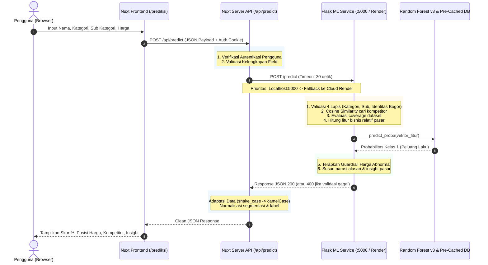

# 08 — Integrasi Web Service (Nuxt) & Machine Learning (Flask)

Dokumen ini disusun untuk menjelaskan secara menyeluruh bagaimana **Web Service (Nuxt Nitro)** berkomunikasi dan mengelola **Flask ML API**, bagaimana model Machine Learning berjalan di lingkungan produksi (*inference*), serta menyajikan **rumus dan simulasi perhitungan manual** yang siap digunakan untuk penyusunan laporan akademis, laporan magang/MBKM, maupun skripsi.

---

## 1. Arsitektur Komunikasi Sistem

Sistem RadarUMKMBogor menggunakan pola arsitektur **Backend-for-Frontend (BFF) / API Gateway Pattern**. Frontend Vue/Nuxt tidak pernah memanggil layanan Python Flask secara langsung dari peramban (browser) pengguna, melainkan melalui perantara **Nuxt Server (Nitro)**.

### Diagram Alur Interaksi (Sequence Diagram)



---

## 2. Cara Web Service (Nuxt Nitro) Menangani Flask API

Implementasi penanganan Flask API pada layer Nuxt server terdapat pada berkas [predict.post.ts](file:///d:/Kuliah/MBKM/Aplikasi%20Prediksi%20Tren%20Pasar/prediksi-tren-pasar/server/api/predict.post.ts).

### A. Autentikasi & Keamanan Sesi
Sebelum melakukan permintaan komputasi ke Flask, server Nuxt memastikan pengguna memiliki sesi login aktif menggunakan `getUserSession(event)`.
```typescript
const session = await getUserSession(event);
if (!session.user) {
  throw createError({ statusCode: 401, message: 'Unauthorized' });
}
```
*Manfaat bagi sistem:* Mencegah eksploitasi API eksternal oleh bot atau pengguna yang belum terautentikasi (*rate abuse prevention*).

### B. Validasi Input di Layer Gateway
Nuxt memastikan variabel input wajib (`namaProduk`, `kategori`, `hargaProduk`) telah terisi sebelum request dikirimkan ke Flask. Jika kosong, sistem langsung mengembalikan status `HTTP 400` tanpa membebani server ML.

### C. Strategi Dual-URL & Toleransi *Cold Start* (Failover)
Layanan Flask di-deploy pada platform **Render (Free Tier)** yang memiliki karakteristik *idle/sleep* setelah 15 menit tidak aktif. Waktu bangun (*cold-start*) Render berkisar 30–60 detik.

Untuk menjamin fleksibilitas saat pengembangan (development) maupun produksi:
1. **Prioritas URL:** Server mencoba URL lokal `http://localhost:5000` terlebih dahulu. Jika Flask lokal tidak aktif atau URL mengarah ke production, server beralih ke `PRODUCTION_URL` (`FLASK_API_URL` dari `.env`).
2. **Timeout Dinamis:** Waktu tunggu dibatasi hingga **30.000 ms (30 detik)** melalui `$fetch`.
```typescript
const LOCAL_URL      = 'http://localhost:5000';
const PRODUCTION_URL = config.flaskApiUrl;

const urls = PRODUCTION_URL === LOCAL_URL
  ? [LOCAL_URL]
  : [LOCAL_URL, PRODUCTION_URL];

for (const url of urls) {
  try {
    flaskData = await $fetch(`${url}/predict`, {
      method : 'POST',
      timeout: 30000,
      body   : flaskBody,
    });
    break;
  } catch (err: any) {
    // Penanganan error cerdas
  }
}
```

### D. Jembatan Penanganan Error Bisnis vs Error Jaringan
Server Nuxt membedakan dua jenis kegagalan:
1. **Error Bisnis (Validasi Flask):** Misalnya harga $\le 0$, kategori tidak cocok, produk bukan khas Bogor, atau produk tidak ada di database. Flask mengembalikan status `error` atau `warning` dengan kode HTTP 400. Nuxt menangkap pesan ini dan melempar `createError({ statusCode: 422, message: body.message })` sehingga frontend dapat menampilkan pesan edukatif.
2. **Error Jaringan / Downtime:** Jika seluruh URL Flask tidak merespons (misal server mati), Nuxt melempar `HTTP 503 Service Unavailable` dengan instruksi pemecahan masalah yang jelas.

### E. Transformasi Data (*Adapter Pattern*)
Nuxt mengonversi konvensi format respon dari Python (**snake_case**) menjadi JavaScript (**camelCase**) serta melakukan pengelompokan segmentasi risiko:
- `peluang_laku_persen` $\rightarrow$ `predictionScore`
- Evaluasi label biner: `predictionLabel = predictionScore >= 50 ? 1 : 0`
- Normalisasi segmen harga: Menyelaraskan istilah `'Premium'` menjadi `'Mahal'` dan mendeteksi kondisi deviasi ekstrem ($< -50\%$) sebagai `'Sangat Murah'`.
- Pemetaan daftar kompetitor, produk terpopuler, dan statistik perankingan kategori pasar.

---

## 3. Cara Kerja Internal Model & Service di Flask (`app.py`)

Layanan Flask berlokasi di `D:\Kuliah\MBKM\Aplikasi Prediksi Tren Pasar\flask_api\app.py`. Saat menerima `POST /predict`, berikut tahapan sistematis yang dieksekusi:

### 1. Pre-Caching Saat Server Startup (Optimasi Latensi)
Agar respons API sangat cepat (< 50 milidetik saat *warm*), operasi berikut dilakukan **satu kali saja saat server dinyalakan**:
- Memuat model pipeline: `model_umkm_bogor_v3.joblib`.
- Memuat data referensi: `dataset_preprocessed.csv` (1.027 data produk hasil scraping).
- Melakukan transformasi awal seluruh teks database menggunakan `TF-IDF Vectorizer` (`X_train_text_db`).
- Memuat tabel statistik pasar per kategori (`market_stats_v3.csv`) dan perankingan popularitas.

### 2. Validasi 4 Lapis Sebelum Komputasi ML
1. **Lapis 1 (Harga Valid):** Menolak jika `harga_produk <= 0`.
2. **Lapis 2 (Kesesuaian Kategori):** Mencocokkan kata kunci teks nama produk terhadap `PRODUK_KATEGORI_MAP`. Jika terdeteksi "Kopi" namun user memilih "Makanan", request ditolak (HTTP 400).
3. **Lapis 3 (Kesesuaian Sub Kategori):** Mencocokkan kata kunci terhadap `PRODUK_SUB_KATEGORI_MAP`. Jika kata kunci "Bolu" dipilihkan sub kategori "Lauk", request ditolak dengan saran memilih "Kue & Roti".
4. **Lapis 4 (Identitas Lokal Bogor):** Mengecek apakah nama produk mengandung entitas lokal Bogor (`KATA_KUNCI_WILAYAH_BOGOR` seperti *bogor, puncak, cisarua, lapis talas, roti unyil*, dsb).

### 3. Pencarian Kompetitor via TF-IDF & Cosine Similarity
- Nama produk di-*stemming* dengan library **PySastrawi** (menghilangkan imbuhan bahasa Indonesia) dan dibersihkan dari *stopwords*.
- Vektor query ditransformasikan ke dimensi TF-IDF.
- Dilakukan perhitungan *Cosine Similarity* antara query vs 1.027 produk referensi.
- Produk dengan skor kemiripan $> 0.05$ diambil (maksimal 6 produk teratas).

### 4. Evaluasi Cakupan Dataset & Blokir Prediksi
- **Jika Kompetitor = 0:** Sistem memblokir prediksi (mengembalikan status error edukatif). Sistem tidak memaksakan prediksi pada produk yang belum memiliki pembanding di database.
- **Peringatan Kemiripan Rendah ($< 15\%$):** Prediksi tetap jalan, namun field `peringatan_dataset` menyertakan catatan akurasi sedang karena produk belum terwakili secara optimal.

### 5. Rekayasa Fitur Relatif Pasar
Model tidak menggunakan harga absolut mentah karena nominal Rp 50.000 pada kategori Makanan bernilai berbeda dengan kategori Pakaian. Fitur yang dihitung meliputi:
- `rasio_harga`: Perbandingan harga terhadap median kategori.
- `zscore_harga`: Standard deviasi harga terhadap rata-rata kategori.
- `log_harga`: Transformasi $\ln(1 + \text{harga})$.
- `segmen_harga`: 0 (Murah), 1 (Menengah), 2 (Mahal) berdasarkan kuartil Q1 dan Q3 kategori.
- `popularity_score`: Diambil dari estimasi kompetitor $(\text{rating} \times \ln(1 + \text{jumlah terjual}))$.
- `jumlah_log` & `revenue_proxy_log`: Estimasi omzet pasar produk sejenis.

### 6. Prediksi Random Forest & Guardrail Bisnis
Model mengeksekusi `predict_proba(input_df)[0][1]`. Namun, untuk mengatasi kelemahan model pohon keputusan terhadap data di luar batas latih (*outliers*), diberlakukan **Guardrail Bisnis (Probabilitas Maksimum)**:
- Jika $\text{Rasio} \ge 5.0\times$ median pasar $\rightarrow$ Probabilitas dibatasi maksimal **2%**.
- Jika $\text{Rasio} \ge 3.0\times$ median pasar $\rightarrow$ Probabilitas dibatasi maksimal **15%**.
- Jika $\text{Rasio} \ge 2.0\times$ median pasar $\rightarrow$ Probabilitas dibatasi maksimal **35%**.
- Jika $\text{Rasio} \ge 1.3\times$ median pasar $\rightarrow$ Probabilitas dibatasi maksimal **45%**.
- Jika $\text{Rasio} < 0.3\times$ median pasar (terlalu murah / mencurigakan) $\rightarrow$ Probabilitas dibatasi maksimal **35%**.

---

## 4. Rumus Matematis & Perhitungan Manual

Bagian ini dapat dikutip langsung ke dalam **Bab III (Metodologi)** atau **Bab IV (Hasil dan Pembahasan)** pada laporan/skripsi.

### Rumus 1: Pembersihan Teks & TF-IDF (Term Frequency - Inverse Document Frequency)
Bobot kata $t$ pada dokumen produk $d$ dalam dataset sebesar $N$ dokumen dihitung dengan:

$$\text{TF}(t, d) = \frac{f_{t, d}}{\sum_{t' \in d} f_{t', d}}$$

$$\text{IDF}(t) = \ln\left(\frac{1 + N}{1 + \text{DF}(t)}\right) + 1$$

$$W_{t, d} = \text{TF}(t, d) \times \text{IDF}(t)$$

### Rumus 2: Kemiripan Produk (Cosine Similarity)
Derajat kemiripan antara vektor kata produk input pengguna ($\vec{A}$) dan vektor kata produk dalam database ($\vec{B}$):

$$\text{Cosine Similarity}(\vec{A}, \vec{B}) = \frac{\vec{A} \cdot \vec{B}}{\|\vec{A}\| \|\vec{B}\|} = \frac{\sum_{i=1}^{n} A_i B_i}{\sqrt{\sum_{i=1}^{n} A_i^2} \times \sqrt{\sum_{i=1}^{n} B_i^2}}$$

### Rumus 3: Popularity Score (Skor Popularitas Gabungan)
Menggabungkan reputasi kepuasan pembeli (*rating*) dan bukti volume penjualan riil (*jumlah terjual*):

$$\text{Popularity Score} = \text{Rating} \times \ln(1 + \text{Jumlah Terjual})$$

### Rumus 4: Fitur-Fitur Relatif Harga Pasar

1. **Rasio Harga terhadap Median Pasar ($R$):**
   $$R = \min\left(\frac{H_{\text{input}}}{M_{\text{kategori}}}, 50\right)$$
   *(Di mana $H_{\text{input}}$ adalah harga produk, dan $M_{\text{kategori}}$ adalah median harga pada kategori tersebut).*

2. **Z-Score Harga ($Z$):**
   $$Z = \text{clip}\left(\frac{H_{\text{input}} - \mu_{\text{kategori}}}{\sigma_{\text{kategori}}}, -5, 5\right)$$
   *(Di mana $\mu$ adalah rata-rata harga kategori dan $\sigma$ adalah standar deviasi).*

3. **Selisih Persentase Harga terhadap Pasar ($\delta$):**
   $$\delta = \frac{H_{\text{input}} - M_{\text{kategori}}}{M_{\text{kategori}}} \times 100\%$$

4. **Transformasi Logaritmik (Stabilisasi Distribusi):**
   $$\text{log\_harga} = \ln(1 + H_{\text{input}})$$
   $$\text{jumlah\_log} = \ln(1 + \text{jumlah\_terjual})$$
   $$\text{revenue\_proxy\_log} = \ln(1 + (H_{\text{input}} \times \text{jumlah\_terjual}))$$

### Rumus 5: Probabilitas Akhir Random Forest (Ensemble Voting)
Jika model Random Forest terdiri dari $M$ pohon keputusan (*Decision Trees*):

$$P(Y=1 \mid X) = \frac{1}{M} \sum_{m=1}^{M} P_m(Y=1 \mid X)$$

Di mana $P_m(Y=1 \mid X)$ adalah estimasi probabilitas kelas 1 (Menarik/Laku) dari pohon ke-$m$.

---

## 5. Simulasi Perhitungan Manual Step-by-Step

Berikut simulasi perhitungan numerik jika diuji secara manual:

### Skenario Data Input Pengguna:
* **Nama Produk:** `"Bolu Talas Bogor Sangkuriang"`
* **Kategori:** `Makanan`
* **Sub Kategori:** `Kue & Roti`
* **Harga Jual ($H_{\text{input}}$):** `Rp 35.000`

---

### Langkah 1: Preprocessing Teks
1. **Case folding & filter simbol:** `"bolu talas bogor sangkuriang"`
2. **Stopword removal** (kata *bogor* masuk identitas, kata stopword dibuang): `"bolu talas sangkuriang"`
3. **Stemming (Sastrawi):** `"bolu talas sangkuriang"`

---

### Langkah 2: Cosine Similarity terhadap Database
Misalkan di database terdapat produk kompetitor:
* Dokumen 1: `"bolu talas bogor keju"` $\rightarrow$ Vektor kata yang cocok: `[bolu, talas]`
* Vektor Query $\vec{A}$: `[bolu: 0.58, talas: 0.58, sangkuriang: 0.58]`
* Vektor Dokumen $\vec{B}$: `[bolu: 0.70, talas: 0.70]`

$$\vec{A} \cdot \vec{B} = (0.58 \times 0.70) + (0.58 \times 0.70) = 0.406 + 0.406 = 0.812$$

$$\|\vec{A}\| = \sqrt{0.58^2 + 0.58^2 + 0.58^2} = 1.00$$

$$\|\vec{B}\| = \sqrt{0.70^2 + 0.70^2} = 0.99$$

$$\text{Sim} = \frac{0.812}{1.00 \times 0.99} = 0.82 \quad (82\% \text{ kemiripan})$$

*Hasil:* Karena $82\% > 35\%$, data kompetitor ditemukan dan field `peringatan_dataset = null` (data referensi sangat representatif).

---

### Langkah 3: Estimasi Metrik Kompetitor
Dari 5 kompetitor teratas yang ditemukan:
* Rata-rata Rating ($\text{rating\_est}$): **4.85**
* Median Terjual ($\text{jumlah\_est}$): **120 unit**

**Perhitungan Popularity Score Kompetitor:**
$$\text{Popularity Score} = 4.85 \times \ln(1 + 120) = 4.85 \times \ln(121) = 4.85 \times 4.7958 = \mathbf{23.26}$$

---

### Langkah 4: Perhitungan Fitur Bisnis Pasar (Kategori "Makanan")
Berdasarkan data referensi pasar kategori Makanan:
* Median Harga ($M$): **Rp 40.000**
* Mean Harga ($\mu$): **Rp 42.500**
* Standar Deviasi ($\sigma$): **Rp 12.000**
* Kuartil 1 ($Q_1$): **Rp 28.000**, Kuartil 3 ($Q_3$): **Rp 50.000**

1. **Rasio Harga ($R$):**
   $$R = \frac{35.000}{40.000} = \mathbf{0.875\times}$$

2. **Z-Score Harga ($Z$):**
   $$Z = \frac{35.000 - 42.500}{12.000} = \frac{-7.500}{12.000} = \mathbf{-0.625}$$

3. **Selisih Persentase ($\delta$):**
   $$\delta = \frac{35.000 - 40.000}{40.000} \times 100\% = \mathbf{-12.5\%}$$
   *(Harga produk 12.5% lebih murah dari median pasar $\rightarrow$ Segmen: **Menengah / Kompetitif**).*

4. **Segmen Kuartil Harga:**
   Karena $28.000 \le 35.000 \le 50.000$, maka `segmen_harga` = **1 (Menengah)**.

5. **Transformasi Log:**
   * $\text{log\_harga} = \ln(1 + 35000) = \ln(35001) = \mathbf{10.463}$
   * $\text{jumlah\_log} = \ln(1 + 120) = \ln(121) = \mathbf{4.796}$
   * $\text{revenue\_proxy\_log} = \ln(1 + (35000 \times 120)) = \ln(4.200.001) = \mathbf{15.250}$

---

### Langkah 5: Prediksi Random Forest & Guardrail
Vektor numerik di atas dinormalisasi oleh `StandardScaler` dan dievaluasi oleh 100 decision tree:
* Misal agregasi pohon menghasilkan probabilitas: **0.865 (86.5%)**.

**Pemeriksaan Guardrail:**
* Rasio harga produk adalah $0.875\times$ (antara $0.3\times$ dan $1.3\times$).
* Tidak melanggar aturan harga ekstrem $\rightarrow$ Nilai probabilitas tetap **86.5%**.

---

### Langkah 6: Output Akhir Sistem
* **Peluang Laku:** **86.5%**
* **Kesimpulan:** **🌟 SANGAT MENARIK**
* **Segmen Pasar:** **Menengah** ($\delta = -12.5\%$)
* **Alasan Otomatis:**
  1. *"Produk serupa sudah banyak dijual (5 kompetitor ditemukan)."*
  2. *"Harga Anda kompetitif, hanya 12% di bawah median pasar (Rp 40.000)."*
  3. *"Produk sejenis terbukti laku keras (rata-rata 120 terjual)."*
  4. *"Model menilai kombinasi nama, kategori, dan posisi harga sangat sesuai tren pasar."*

---

## 6. Rangkuman Komponen untuk Laporan / Skripsi

| Bab / Aspek | Materi yang Digunakan dari Dokumen Ini |
|---|---|
| **Bab III: Arsitektur Sistem** | Diagram sequence alur BFF Nuxt Nitro ke Flask API, strategi failover dual-URL, dan mekanisme timeout 30 detik. |
| **Bab III: Preprocessing Data** | Tokenisasi, Sastrawi Stemmer, filter stopwords, TF-IDF Vectorizer 1000 dimensi. |
| **Bab III: Desain Fitur (Feature Engineering)** | Rasio harga terhadap median kategori, Z-Score harga, Popularity Score gabungan, log transform omzet. |
| **Bab IV: Implementasi** | Endpoint `POST /predict`, pemetaan struktur JSON request/response, dan mekanisme guardrail harga abnormal. |
| **Bab IV: Pengujian & Validasi Manual** | Subbab "Simulasi Perhitungan Manual" di atas dapat dicantumkan sebagai bukti verifikasi kebenaran algoritma sistem. |
